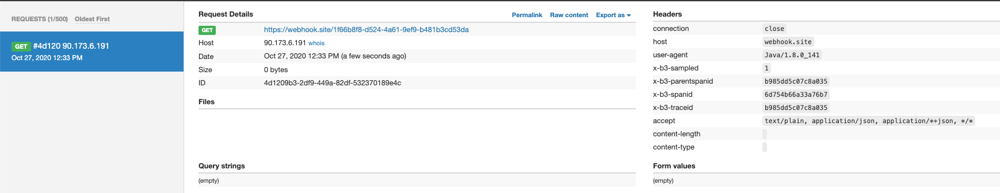

# Trazabilidad en servicios distribuidos

Espero que este sea el primero de una serie de articulos donde podamos ver como gestionar peticiones a través de varios microservicios.

Devido a la evolución tecnológica sufrida en los ultimos años, los sistemas de logs y trazas deverían de obtener mayor peso en las aplicaciones. Esto es devido a los sistemas distribuidos y a la propagación de los microservicios.

En el pasado, con las aplciaciones monoliticas, rastrear una petición podía ser algo tan sencillo como filtrar por el identificador del hilo generado en la petición.

En los nuevos sistemas de microservicios, esto es imposible, ya que una aplciación puede estar formada por 1 o n microservicios, lo que impide hacer estos rastreos.

Para evitar estos problemas, todas las aplicaciones basadas en microservicios deberían de hacer uso de las etiquetas B3 (X-B3-TraceId, X-B3-ParentSpanId, X-B3-SpanId , X-B3-Sampled). Estas etiquetas se encargan de transportar la información necesaria para enlazar la información generada (logs y trazas) de diferentes sistemas y de esta forma poder trazas las aplciaciones.

El framework de Spring Cloud nos proporciona la librería [Sleuth](https://spring.io/projects/spring-cloud-sleuth) para la propagación de las cabeceras B3.

El problema se produce cuando en nuestras organizaciones se decide utilizar otros nombres para propagar la información. El presente articulo trata de como utilizar otros nombres para las cabeceras, teniendo en cuenta que Sleuth no nos permite eliminar las cabceras originales.

## Configuración

El primer paso será configurar nuestro proyecto para dotarle de la capacidad de propagación de cabeceras. Para ello agregaremos la dependencia con Sleuth

```xml

    <properties>
		<spring-cloud.version>Hoxton.SR8</spring-cloud.version>
	</properties>

	<dependencies>
		<dependency>
			<groupId>org.springframework.cloud</groupId>
			<artifactId>spring-cloud-starter-sleuth</artifactId>
		</dependency>

	</dependencies>

	<dependencyManagement>
		<dependencies>
			<dependency>
				<groupId>org.springframework.cloud</groupId>
				<artifactId>spring-cloud-dependencies</artifactId>
				<version>${spring-cloud.version}</version>
				<type>pom</type>
				<scope>import</scope>
			</dependency>
		</dependencies>
	</dependencyManagement>

```

## Montando nuestro cliente ...

El siguiente paso será crear un cliente capaz de invocar a un servicio a traves del conector RestTemplate de spring. Sleuth, permite utilizar diferentes conectores, pero en este articulo nos centraremos en RestTempalte.

Es importante que el componente RestTemplate utilizado sea un bean inyectado en nuestro contesto, es decir, no podemos utilizar la sentencia `new RestTempalte()` ya que sleuth no tendría capacidad para inyectar los interceptores o filtros necesarios, para ello generamos un bean en el contexto de tipo RestTemplate

```java
@Configuration
public class configuration {

    @Bean
    public RestTemplate getRestTemplate() {
        return new RestTemplate();
    }
}
```

Posteriormente hacemos uso del bean en nuestro service.

```java
@Service
public class BookServiceImpl implements BookService {

    private RestTemplate restTemplate;

    @Autowired
    public BookServiceImpl(RestTemplate restTemplate) {
        this.restTemplate = restTemplate;
    }

    public String getBook(String bookName) {

        ResponseEntity<String> book = restTemplate.getForEntity("https://webhook.site/1f66b8f8-d524-4a61-9ef9-b481b3cd53da", String.class);

        return book.getBody();

    }
}
```

Esta primera prueba generará la siguiente petición



Tal y como podemos ver, en las cabeceras enviadas, se incluyen las cabceras B3 con la información correspondiente.

## Generando nuevas cabeceras

Ahora es el momento de generar nuevas cabeceras, en concreto generaremos la cabecera `xTraceId` cuyo valor será un UUID aleatorio.

En primer lugar generaremos un nuevo filtro capaz de identificar si la cabecera nos biene rellena desde un cliente y por tanto propagamos su valor o si por el contrario, no viene valor y tendremos que generar un nuevo valor para la misma.

```java

@Component
public class TraceFilter extends GenericFilterBean {

    private final Tracer tracer;

    TraceFilter(Tracer tracer) {
        this.tracer = tracer;
    }

    @Override
    public void doFilter(ServletRequest request, ServletResponse response, FilterChain chain) throws IOException, ServletException {

        Span currentSpan = this.tracer.currentSpan();

        if (currentSpan == null) {
            chain.doFilter(request, response);
            return;
        }

        // get header value
        String xTraceId = ((HttpServletRequest) request).getHeader(Constant.X_TRACE_ID);

        if (StringUtils.isBlank(xTraceId)) {
            xTraceId = UUID.randomUUID().toString();
            // set value to header
            ExtraFieldPropagation.set(currentSpan.context(), Constant.X_TRACE_ID, xTraceId);
        }

        // set header to response
        ((HttpServletResponse) response).addHeader(Constant.X_TRACE_ID, xTraceId);
        currentSpan.tag(Constant.X_TRACE_ID, xTraceId);

		MDC.put(Constant.X_TRACE_ID, xTraceId);

        chain.doFilter(request, response);
    }
}
```

Ahora la request que realicemos será así:


Y la respuesta de nuestro servicio también nos retornará la información.


Prestemos especial atención a la sentencia `MDC.put(Constant.X_TRACE_ID, xTraceId);`, esta nos permite disponer de la información a la hora de pintar los logs de nuestra aplciación.

## Configurando logback

Ahora ha llegado el momento de configurar las trazas de nuestra aplcaición, para ello utilizaremos logback, generando un apender propio para mostrar la información del traceId generado.

En primer lugar agregaremos logback a nuestro proyecto

```xml

		<logback.version>1.2.3</logback.version>

		<!-- Logback -->
		<dependency>
			<groupId>ch.qos.logback</groupId>
			<artifactId>logback-core</artifactId>
			<version>${logback.version}</version>
		</dependency>

		<dependency>
			<groupId>ch.qos.logback</groupId>
			<artifactId>logback-classic</artifactId>
			<version>${logback.version}</version>
		</dependency>
```

Generaremos un nuevo appender que nos muestre el traceId de la paetición en las trazas.

```xml
	<appender name="default-logger" class="ch.qos.logback.core.ConsoleAppender">
        <layout class="ch.qos.logback.classic.PatternLayout">
            <pattern>%yellow(%d{HH:mm:ss.SSS}) %highlight(%-5level) %boldGreen(%logger{40}) - TraceId: %X{xTraceId:-} - %msg%n</pattern>
        </layout>
    </appender>
```

Esto mostrará como salida la siguiente traza


En las proximas entregas, podremos ver:

- Como el servicio servidor recupera el traceId enviado desde el cliente y pinta las trazas con el mismo traceId.
- Preparamos los appenders para que generen la información en formato Json para poder ser enviados a sistemas centralizados de información.

El código fuente del proyecto se puede consultar en el siguente enlace de [github]()
