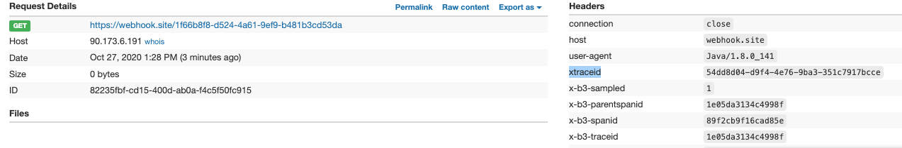
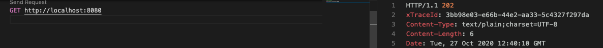
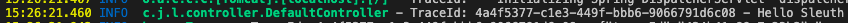

# Traceability in distributed services

I hope this is the first in a series of articles where we can see how to manage requests through various microservices.

Due to the technological evolution suffered in recent years, the log and trace systems should obtain greater weight in the applications. This is due to distributed systems and the spread of microservices.

In the past, with monolithic applications, tracing a request could be as simple as filtering by the thread identifier generated in the request.

In newer microservices systems, this is impossible, since an application can consist of 1 or n microservices, which prevents these crawls.

To avoid these problems, all microservice-based applications should make use of the B3 tags (X-B3-TraceId, X-B3-ParentSpanId, X-B3-SpanId, X-B3-Sampled). These labels are in charge of transporting the necessary information to link the information generated (logs and traces) of different systems and in this way to be able to trace the applications.

The Spring Cloud framework provides us with the [Sleuth] library (https://spring.io/projects/spring-cloud-sleuth) for the propagation of B3 headers.

The problem occurs when our organizations decide to use other names to spread the information. This article deals with how to use other names for the headers, keeping in mind that Sleuth does not allow us to remove the original headers.

## Configuration

The first step will be to configure our project to provide it with the ability to propagate headers. For this we will add the dependency with Sleuth

```xml

    <properties>
		<spring-cloud.version>Hoxton.SR8</spring-cloud.version>
	</properties>

	<dependencies>
		<dependency>
			<groupId>org.springframework.cloud</groupId>
			<artifactId>spring-cloud-starter-sleuth</artifactId>
		</dependency>

	</dependencies>

	<dependencyManagement>
		<dependencies>
			<dependency>
				<groupId>org.springframework.cloud</groupId>
				<artifactId>spring-cloud-dependencies</artifactId>
				<version>${spring-cloud.version}</version>
				<type>pom</type>
				<scope>import</scope>
			</dependency>
		</dependencies>
	</dependencyManagement>

```

## Building our client ...

The next task will be to create a client capable of invoking a service through spring's RestTemplate connector. Sleuth, allows you to use different connectors, but in this article we will focus on RestTempalte.

It is important that the RestTemplate component used is a bean injected in our answer, that is, we cannot use the `new RestTemplate ()` statement since sleuth would not have the capacity to inject the necessary interceptors or filters, for this we generate a bean in context of type RestTemplate

```java
@Configuration
public class configuration {

    @Bean
    public RestTemplate getRestTemplate() {
        return new RestTemplate();
    }
}
```

Later we use the bean in our service.

```java
@Service
public class BookServiceImpl implements BookService {

    private RestTemplate restTemplate;

    @Autowired
    public BookServiceImpl(RestTemplate restTemplate) {
        this.restTemplate = restTemplate;
    }

    public String getBook(String bookName) {

        ResponseEntity<String> book = restTemplate.getForEntity("https://webhook.site/1f66b8f8-d524-4a61-9ef9-b481b3cd53da", String.class);

        return book.getBody();

    }
}
```

This first test will generate the following request


As we can see, in the headers sent, the B3 headers are included with the corresponding information.

## Generating new headers

Now is the time to generate new headers, specifically we will generate the `xTraceId` header whose value will be a random UUID.

In the first place we will generate a new filter capable of identifying if the header has been filled in from a client and therefore we propagate its value or if, on the contrary, there is no value and we will have to generate a new value for it.

```java

@Component
public class TraceFilter extends GenericFilterBean {

    private final Tracer tracer;

    TraceFilter(Tracer tracer) {
        this.tracer = tracer;
    }

    @Override
    public void doFilter(ServletRequest request, ServletResponse response, FilterChain chain) throws IOException, ServletException {

        Span currentSpan = this.tracer.currentSpan();

        if (currentSpan == null) {
            chain.doFilter(request, response);
            return;
        }

        // get header value
        String xTraceId = ((HttpServletRequest) request).getHeader(Constant.X_TRACE_ID);

        if (StringUtils.isBlank(xTraceId)) {
            xTraceId = UUID.randomUUID().toString();
            // set value to header
            ExtraFieldPropagation.set(currentSpan.context(), Constant.X_TRACE_ID, xTraceId);
        }

        // set header to response
        ((HttpServletResponse) response).addHeader(Constant.X_TRACE_ID, xTraceId);
        currentSpan.tag(Constant.X_TRACE_ID, xTraceId);

		MDC.put(Constant.X_TRACE_ID, xTraceId);

        chain.doFilter(request, response);
    }
}
```

Now the request we make will be like this:



And the response of our service will also return the information.



We pay special attention to the sentence `MDC.put (Constant.X_TRACE_ID, xTraceId);`, this allows us to have the information when painting the logs of our application.

## Configuring logback

Now the time has come to configure the traces of our application, for this we will use logback, generating our own apender to show the information of the generated traceId.

First we will add logback to our project

```xml

		<logback.version>1.2.3</logback.version>

		<!-- Logback -->
		<dependency>
			<groupId>ch.qos.logback</groupId>
			<artifactId>logback-core</artifactId>
			<version>${logback.version}</version>
		</dependency>

		<dependency>
			<groupId>ch.qos.logback</groupId>
			<artifactId>logback-classic</artifactId>
			<version>${logback.version}</version>
		</dependency>
```

We will generate a new appender that shows us the traceId of the pattern in the traces.

```xml
	<appender name="default-logger" class="ch.qos.logback.core.ConsoleAppender">
        <layout class="ch.qos.logback.classic.PatternLayout">
            <pattern>%yellow(%d{HH:mm:ss.SSS}) %highlight(%-5level) %boldGreen(%logger{40}) - TraceId: %X{xTraceId:-} - %msg%n</pattern>
        </layout>
    </appender>
```

This will output the following trace



In the next chapters, we can see:

- How the server retrieves the traceId sent from the client and paints the traces with the same traceId.
- We prepare the appenders to generate the information in Json format to be able to be sent to centralized information systems.

The source code of the project can be consulted in the following link of [github](https://github.com/jichu20/logs-training/tree/develop/logger-client)
