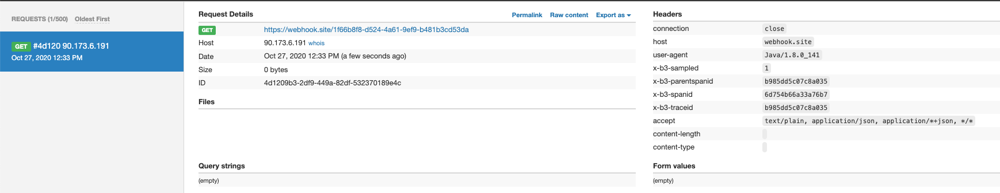
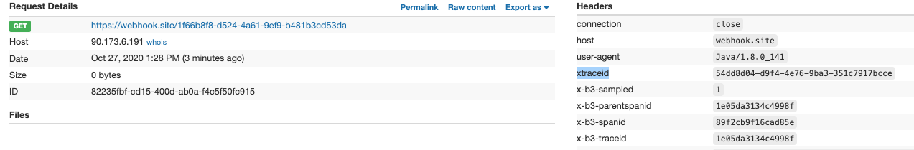
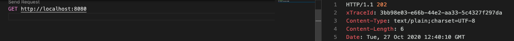
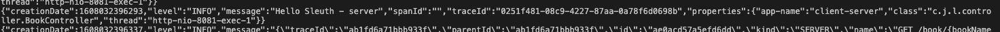

# Trazabilidad en servicios distribuidos parte II

En el articulo [anteriro](https://jichu20.medium.com/traceability-in-distributed-services-bb3f67a67cb4), vimos como transportar el valor de ciertas cabeceras a través de nuestro servicio de modo que pudieramos disponer de un identificador único 'xTraceId' en todos nuestros servicios de modo que pudieramos trazar una petición y enlazar los logs que se generan en los diferentes micro servicios que forman parte de nuesta sistema.

En este post, vamos a integrar dichos cambios en nuestra aplicación servidor de modo que podamos ver como el valor de la cabcera xTraceId es el mismo en los diferentes servicios por los que pasa nuestra petición.

Después veremos como modificar la configuración de logback para genearar las trazas en formato Json y por ultimo incluiremos la generación de trazas para una aplicación propia.

Todos estos cambios estarán basados en la librería de spring [Sleuth](https://spring.io/projects/spring-cloud-sleuth).

## Integración de cambios en el servidor

Recordemos que todas las clases descritas en el articulo anterior las hemos generado en una librería, esto nos permitirá incluir la funcionalidad descrita en todos nuestros microservicios.

Por tanto generaremos una nueva aplciación 'logger-server' e incluiremos en nuestro archivo pom, la referencia a la nueva librería

```xml

    <properties>
		<spring-cloud.version>Hoxton.SR8</spring-cloud.version>
	</properties>

	<dependencies>

		<dependency>
			<groupId>com.jichu20</groupId>
			<artifactId>logger-lib</artifactId>
			<version>0.0.1-SNAPSHOT</version>
		</dependency>
	</dependencies>
```

## Modificando el cliente ...

Modificaremos el servicio cliente para que las peticiones apunten al nuevo servicio servidor.

```java
@Service
public class BookServiceImpl implements BookService {

    private RestTemplate restTemplate;

    @Autowired
    public BookServiceImpl(RestTemplate restTemplate) {
        this.restTemplate = restTemplate;
    }

    public BookDto getBook(String bookName) {

        ResponseEntity<BookDto> book = restTemplate.getForEntity("http://localhost:8081/book/TreasureIsland ", BookDto.class);

        return book.getBody();

    }
}
```

## Creando el servidor

En el servicio que hace las veces de servidor, crearemos un controllador y un servicio

@controller

```java

    @Autowired
    BookService bookService;

    @GetMapping("/{bookName}")
    public ResponseEntity<BookDto> getBook(@PathVariable("bookName") String bookName) throws InterruptedException {

        logger.info("Hello Sleuth - server");
        return new ResponseEntity<BookDto>(bookService.getBook(bookName), HttpStatus.ACCEPTED);

    }
```

@service

```java

     public BookDto getBook(String bookName) {

        return new BookDto(bookName, "resume of the book", "Robert Louis Stevenson", 2);

    }
```

El siguiente paso será crear un cliente capaz de invocar a un servicio a traves del conector RestTemplate de spring. Sleuth, permite utilizar diferentes conectores, pero en este articulo nos centraremos en RestTemplate.

Es importante que el componente RestTemplate utilizado sea un bean inyectado en nuestro contesto, es decir, no podemos utilizar la sentencia `new RestTemplate()` ya que sleuth no tendría capacidad para inyectar los interceptores o filtros necesarios, para ello generamos un bean en el contexto de tipo RestTemplate

```java
@Configuration
public class configuration {

    @Bean
    public RestTemplate getRestTemplate() {
        return new RestTemplate();
    }
}
```

A continuación ejecutaremos una petición contra el cliente para consultar las trazas en los dos servicios

Esta primera prueba generará la siguiente petición



Tal y como podemos ver, en las cabeceras enviadas, se incluyen las cabceras B3 con la información correspondiente.

## Generando nuevas cabeceras

Ahora es el momento de generar nuevas cabeceras, en concreto generaremos la cabecera `xTraceId` cuyo valor será un UUID aleatorio.

En primer lugar generaremos un nuevo filtro capaz de identificar si la cabecera nos biene rellena desde un cliente y por tanto propagamos su valor o si por el contrario, no viene informada y tendremos que generar un nuevo valor para la misma.

```java

@Component
public class TraceFilter extends GenericFilterBean {

    private final Tracer tracer;

    TraceFilter(Tracer tracer) {
        this.tracer = tracer;
    }

    @Override
    public void doFilter(ServletRequest request, ServletResponse response, FilterChain chain) throws IOException, ServletException {

        Span currentSpan = this.tracer.currentSpan();

        if (currentSpan == null) {
            chain.doFilter(request, response);
            return;
        }

        // get header value
        String xTraceId = ((HttpServletRequest) request).getHeader(Constant.X_TRACE_ID);

        if (StringUtils.isBlank(xTraceId)) {
            xTraceId = UUID.randomUUID().toString();
            // set value to header
            ExtraFieldPropagation.set(currentSpan.context(), Constant.X_TRACE_ID, xTraceId);
        }

        // set header to response
        ((HttpServletResponse) response).addHeader(Constant.X_TRACE_ID, xTraceId);
        currentSpan.tag(Constant.X_TRACE_ID, xTraceId);

		MDC.put(Constant.X_TRACE_ID, xTraceId);

        chain.doFilter(request, response);
    }
}
```

Ahora la request que realicemos será así:



Y la respuesta de nuestro servicio también nos retornará la información.



Prestemos especial atención a la sentencia `MDC.put(Constant.X_TRACE_ID, xTraceId);`, esta nos permite disponer de la información a la hora de escribir los logs de nuestra aplicación.

## Configurando logback

Es el momento de modificar nuestra configuración de logback para la generación de logs en formato Json, posteriormente podremos utilizar otros procesos para el envio de estos logs a sistemas centralizados.

Para realizar dicha configuración uilizaremos la librería [logsthas](https://github.com/logstash/logstash-logback-encoder), que proporciona diferentes appenders, layouts, ... para logback. Para ello agregaremos la dependencia.

```xml
        <!-- logstash -->
		<dependency>
			<groupId>net.logstash.logback</groupId>
			<artifactId>logstash-logback-encoder</artifactId>
			<version>6.4</version>
		</dependency>
```

Ahora agregaremos un nuevo appender a nuestra configuración

```xml
    <springProperty scope="context" name="springAppName" source="spring.application.name"/>

    <appender name="json-appender" class="ch.qos.logback.core.ConsoleAppender">
        <encoder class="net.logstash.logback.encoder.LoggingEventCompositeJsonEncoder">
            <providers>
                <timestamp>
                    <fieldName>creationDate</fieldName>
                    <pattern>[UNIX_TIMESTAMP_AS_NUMBER]</pattern>
                </timestamp>
                <pattern>
                    <pattern>
        			{
        				"level": "%level",
  						"message": "%msg",
						"spanId": "%X{X-B3-SpanId:-}",
						"traceId": "%X{xTraceId:-}",
						"properties": {
							"app-name": "${springAppName:-}",
							"class": "%logger{40}",
							"thread": "%thread"
  						}
        			}
                    </pattern>
                </pattern>

            </providers>
        </encoder>
    </appender>
```

Cuando ejecutemos nuestra aplciación, podremos obserbar que las trazas, ahora tienen un formato json



## Extra

### Conversores en el appender

En nuestro apender, podemos agregar conversores, por ejemplo, podemos querer sacar la fecha en formato nanosegundos.

Para ello generaremos una nueva clase denominada `NanoSecondsConverter.java` con el siguiente código

```java

import java.util.concurrent.TimeUnit;

import ch.qos.logback.classic.pattern.ClassicConverter;
import ch.qos.logback.classic.spi.ILoggingEvent;

public class NanoSecondsConverter extends ClassicConverter {

    long start = System.nanoTime();

    @Override
    public String convert(ILoggingEvent event) {
        return Long.toString(TimeUnit.MILLISECONDS.toNanos(event.getTimeStamp()));
    }
}
```

y modificaremos el appender para incluir un nuevo campo que contenga la fecha en formato nano segundos

```xml
    <!-- custom converters -->
    <conversionRule conversionWord="nanos" converterClass="com.jichu20.loggerlib.converter.NanoSecondsConverter" />

    ... ... ...
    "creationDateNano": "#asLong{%-19nanos}",
    ... ... ...
```

### Interceptores

También disponemos de la posibilidad de agregar interceptores a nuestro restTemplate para que muestre tanto las peticiones realizadas como las respuestas recibidas.

Para ello incluiremos en nuestro proyecto la clase `RequestResponseLoggingInterceptor.java` y modificaremos la definición del bean restTemplate del siguiente modo.

```java

    @Bean
    public RestTemplate getRestTemplate() {
        RestTemplate restTemplate = new RestTemplate();

        if (restTemplate.getInterceptors() == null) {
            restTemplate.setInterceptors(new ArrayList<>());
        }

        restTemplate.getInterceptors().add(new RequestResponseLoggingInterceptor());

        return restTemplate;

    }

```

Esto permitirá que todas las instancias de nuestro bean, incluyan a nuestro interceptor lo que nos permitirá generar trazas en el cliente como las siguientes:

Request

```json
{
  "creationDate": 1608033541998,
  "level": "INFO",
  "message": "===========================request begin================================================\nURI         : http://localhost:8081/book/elbarcodelpirata\nMethod      : GET\nHeaders     : [Accept:\"application/json, application/*+json\", Content-Length:\"0\", X-B3-TraceId:\"2087a978b522188d\", X-B3-SpanId:\"acb69697a19b720b\", X-B3-ParentSpanId:\"2087a978b522188d\", X-B3-Sampled:\"1\", xtraceid:\"0407a46e-7c55-4613-a264-b2a320255c77\"]\n==========================request end================================================",
  "spanId": "",
  "traceId": "0407a46e-7c55-4613-a264-b2a320255c77",
  "properties": {
    "app-name": "client-logger",
    "class": "c.j.l.i.RequestResponseLoggingInterceptor",
    "thread": "http-nio-8080-exec-1"
  },
  "creationDateNano": 1608033541998000000
}
```

Response

```json
{
  "creationDate": 1608033542219,
  "level": "INFO",
  "message": "============================response begin==========================================\nStatus code  : 202 ACCEPTED\nStatus text  : \nHeaders      : [xTraceId:\"0407a46e-7c55-4613-a264-b2a320255c77\", Content-Type:\"application/json\", Transfer-Encoding:\"chunked\", Date:\"Tue, 15 Dec 2020 11:59:02 GMT\", Keep-Alive:\"timeout=60\", Connection:\"keep-alive\"]\nResponse body: {\"name\":\"elbarcodelpirata\",\"resume\":\"resume of the book\",\"author\":\"Robert Louis Stevenson\",\"numPAges\":2}=======================response end=================================================",
  "spanId": "",
  "traceId": "0407a46e-7c55-4613-a264-b2a320255c77",
  "properties": {
    "app-name": "client-logger",
    "class": "c.j.l.i.RequestResponseLoggingInterceptor",
    "thread": "http-nio-8080-exec-1"
  },
  "creationDateNano": 1608033542219000000
}
```
